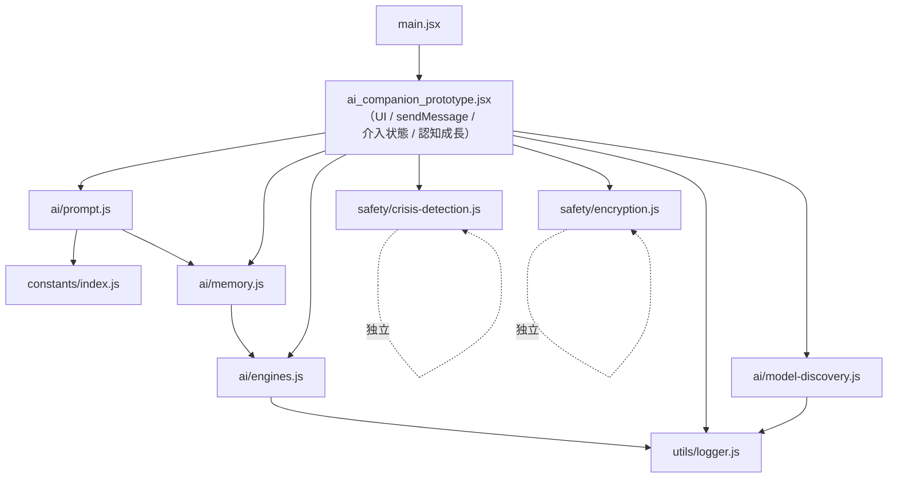
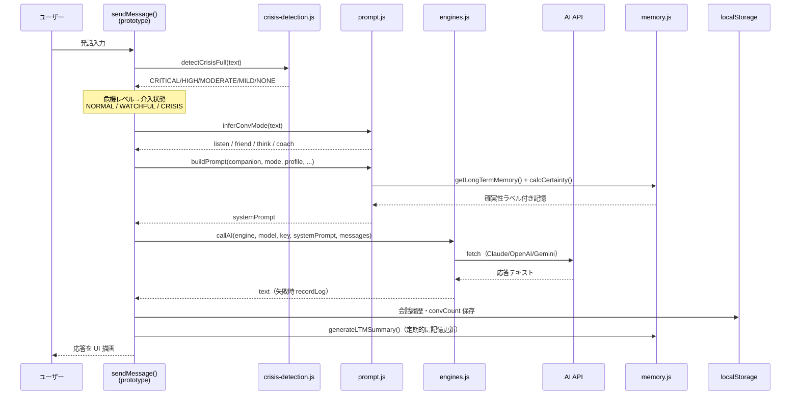

# コード処理一覧 (CODE_OVERVIEW)

> 本書はコードベースの「処理内容」を関数レベルで一望するための一次資料です。
> 「どのファイルに・どんな処理があり・どう連携して1ターンが進むか」を、全体像 → 詳細の順で把握できます。

## 1. はじめに

- **目的**: 新規参加者・将来の自分が短時間でコード処理を把握できるようにする（理解負債の解消）。
- **対象読者**: コードを読む開発者。思想・運用は `README.md` / `SAFETY_FRAMEWORK.md` / `CLAUDE.md` を参照。
- **正規実装は `src/`**。`ai_companion_prototype.jsx`（約3,500行）は UI とオーケストレーション層（`sendMessage()`・介入状態管理・認知成長スキャフォールディング）を担い、コアロジックはすべて `src/` から import する。
- **✅ 二重実装は解消済み**: かつて prototype 内に存在した危機検知・プロンプト生成・AI呼び出し・暗号化・記憶・ロガー・定数の重複コピーは削除され、`src/` に一本化された。`src/` の修正はそのまま稼働アプリに反映される。残るのは開発用 `DEBUG_AI` フラグを注入する2つの薄いアダプタ（`callAI`/`buildPrompt`）のみ（経緯は `PROJECT_REVIEW.md` §1.1・§4.2）。
- **更新方針**: `src/` または `api/` の関数を追加・変更・削除したら本書の該当表も更新する。

## 2. モジュール一覧（src/）

| パス | 役割 | 主要エクスポート | 主な依存 |
|------|------|------------------|----------|
| `main.jsx` | React エントリ。`ai_companion_prototype.jsx` の `AICompanionApp` を描画 | （default import 起動のみ） | `ai_companion_prototype.jsx` |
| `constants/index.js` | アプリ全体の定数テーブル | `INTERESTS` `VOICES` `THEMES` `ACCENTS` `AI_ENGINES` `DEFAULT_SETTINGS` `DEFAULT_API_MODELS` | なし |
| `constants/hosted-tiers.js` | ホスト型ティア別モデルの単一情報源 | `HOSTED_TIER_MODELS` | なし |
| `ai/engines.js` | Claude/OpenAI/Gemini/Llama への統一 API アダプタ（ユーザー鍵使用） | `callAI()` `maskKey` | `utils/logger.js` |
| `ai/memory.js` | 長期記憶 CRUD + 時間減衰 + 復号ミラー | `getLongTermMemory()` `calcCertainty()` `certaintyLabel()` `detectPinRequest` `generateLTMSummary()` `setLtmCache()` `clearLtmCache()` | `ai/engines.js` `safety/secure-storage.js` |
| `ai/prompt.js` | システムプロンプト生成・会話モード推定 | `CONV_MODES` `inferConvMode()` `buildPrompt()` `parseSettingAction()` | `constants/index.js` `ai/memory.js` |
| `ai/model-discovery.js` | 各社の list models API からモデルを動的検出 | `discoverModels()` `mergeModels()` | `utils/logger.js` |
| `safety/crisis-detection.js` | C-SSRS 準拠 多層危機検知（L1〜L4）+ 緊急連絡先 | `detectCrisisFull()` `detectCrisis()` … `HOTLINE_CONTACTS` `HOTLINES` | なし（独立） |
| `safety/encryption.js` | AES-256-GCM 暗号プリミティブ・エクスポート/インポート | `encryptData()` `decryptData()` `exportCompanionData()` `importCompanionData()` `collectMigratable()` `applyMigratable()` | なし（Web Crypto） |
| `safety/secure-storage.js` | 会話データの保存時暗号化（オプトイン） | `secureRead()` `secureWrite()` `setSessionPin()` `migrateToEncrypted()` `ENCRYPTED_KEYS` | `safety/encryption.js` |
| `utils/logger.js` | PII 不含エラーログ | `recordLog()` `getLogs()` `exportLogs()` `clearLogs()` `classifyApiError()` `ERR` | なし |

## 3. 依存関係図



依存の主軸: `prompt.js → memory.js → engines.js → logger.js`。`crisis-detection.js` と `encryption.js` は外部依存を持たない独立モジュール。

> 注: prototype から各 src モジュールへの矢印は実際の import 関係を表す（二重実装解消済み・§1 参照）。

## 4. 処理フロー: 1ターンの流れ

ユーザー発話から AI 応答・記憶更新までの典型的な流れ。オーケストレーションは `ai_companion_prototype.jsx` の `sendMessage()` が担い、各ステップで `src/` の関数を呼ぶ。



ステップ対応の早見:

| ステップ | 関数 | ファイル |
|----------|------|----------|
| 危機検知 | `detectCrisisFull()` | `safety/crisis-detection.js` |
| 会話モード推定 | `inferConvMode()` | `ai/prompt.js` |
| プロンプト生成 | `buildPrompt()` | `ai/prompt.js` |
| 記憶の確実性計算 | `getLongTermMemory()` / `calcCertainty()` | `ai/memory.js` |
| AI 呼び出し | `callAI()` | `ai/engines.js` |
| 記憶更新 | `generateLTMSummary()` | `ai/memory.js` |
| エラー記録 | `recordLog()` | `utils/logger.js` |

## 5. モジュール別 関数サマリ

### ai/engines.js — AI 統一アダプタ

| 関数 | 概要 | 主な入出力 |
|------|------|-----------|
| `callAI(engineId, model, apiKey, systemPrompt, messages, phase="chat")` | エンジン ID に応じて Anthropic / OpenAI / Gemini の各 REST API を呼び分け、応答テキストを抽出して返す。ネットワーク・API エラーは `recordLog()` 後に throw | in: エンジン種別・モデル・鍵・プロンプト / out: `string`（応答） |
| `maskKey(k)` | API キーを先頭8文字＋末尾4文字でマスク表示 | in: 鍵文字列 / out: マスク文字列 |

補足: `llama` は `options.llamaEndpoint`（既定 `http://localhost:8080`、Ollama は 11434 判定）のローカルサーバーへ OpenAI 互換形式で送信。`options.debugThinking` は開発用で、Claude の Extended Thinking を有効化し `<thinking>/<response>` 形式で返す。

### ai/memory.js — 長期記憶

| 関数 | 概要 | 主な入出力 |
|------|------|-----------|
| `getLongTermMemory()` | `localStorage["aico_longTermMemory"]` から記憶配列を読み込み（失敗時 `[]`） | out: エントリ配列 |
| `calcCertainty(entry, currentConvCount)` | 経過会話数に応じ確実性スコアを減衰（>300→×0.4, >100→×0.6, >20→×0.8）。`pinned` は常に 5。0〜5 に正規化 | in: エントリ・現会話数 / out: `0..5` |
| `certaintyLabel(score)` | スコア→日本語ラベル（確実(5)〜断片(1)、0 は `null`＝忘却） | in: `0..5` / out: ラベル or null |
| `detectPinRequest(text)` / `detectUnpinRequest(text)` | ピン留め／解除の依頼文を正規表現で検出 | in: text / out: `boolean` |
| `generateLTMSummary(engineId, model, apiKey, companion, profile, recentMsgs, options)` | 直近20件のユーザー発話を AI に渡し、確実性付き JSON の記憶エントリを生成・保存（最大200件、超過分は古い順に削除）。`options` は `callAI` に透過 | out: 生成エントリ or null |

### ai/prompt.js — プロンプト生成

| 関数/定数 | 概要 | 主な入出力 |
|-----------|------|-----------|
| `CONV_MODES` | 4 会話モード定義（`listen` 傾聴/`friend` 友人/`think` 対話/`coach` コーチ）。各モードに `inst`（プロンプト埋め込み指示）を持つ | 定数オブジェクト |
| `inferConvMode(text, currentConvMode)` | 発話の感情キーワードからモードを自動推定（つらい→listen, どうすれば→coach, なぜ→think, 今日/楽しい→friend） | in: text / out: モード ID |
| `buildPrompt(companion, mode, profile, appSettings, convMode="friend")` | 絶対原則（三原則）＋人格＋自立促進＋時間認識＋興味＋会話モード指示＋長期記憶（確実性ラベル付き直近15件）＋設定文脈を合成し、完全なシステムプロンプトを返す。`mode` が `CRISIS`/`WATCHFUL` のとき安全優先の応答指示（MI 法等）に切替 | in: 各種設定 / out: `string` |
| `parseSettingAction(text)` | AI 出力中の `{"action":"set_setting",...}` を抽出し設定変更を解釈 | in: text / out: `{key, value}` or null |

### safety/crisis-detection.js — 多層危機検知（C-SSRS 準拠）

| レイヤー | 関数 | 手法 / 返り値 |
|----------|------|---------------|
| L1 | `detectCrisis(text)` | 正規表現パターン（`CRISIS_PATTERNS`）→ `CRITICAL`/`HIGH`/`MODERATE`/`MILD`/`NONE` |
| L2 | `detectCognitiveDistortions(text)` | CBT 認知の歪み5分類（Beck）のマッチ型数 → 3+:HIGH / 2:MODERATE / 1:MILD / 0:NONE |
| L3 | `detectEmotionalState(text)` | DBT 感情モデリング。`{emotionType, intensity(0..1), dysregulated, joinerRisk}` を返す（Joiner 理論：孤立感∧負担感＝高リスク） |
| L3→ | `emotionalStateToCrisisLevel(state)` | 上記状態を `HIGH`/`MODERATE`/`MILD`/`NONE` に変換 |
| L4 | `detectLongitudinalChange(wellbeingHistory)` | ウェルビーイング履歴（直近4件平均）から `{trend, riskBoost}` を算出 |
| 統合 | `detectCrisisComposite(text)` | L1+L2 の高い方を返す |
| 統合 | `detectCrisisFull(text)` | **L1+L2+L3 の最大レベル**を返す（CRITICAL は L1 で即返し）。1ターンの危機判定はこれを使用 |

補助述語: `isAbusive(text)` / `isLazy(text)` / `isDependencyRisk(text)`。定数: `CRISIS_PATTERNS` `CBT_DISTORTION_PATTERNS` `EMOTION_TYPE_PATTERNS` `DYSREGULATION_PATTERNS` `JOINER_ISOLATION_PATTERNS` `JOINER_BURDEN_PATTERNS` `DEPENDENCY_SIGNS` `HOTLINES`。

> ⚠ `CRISIS_PATTERNS` の追加・変更・削除は C-SSRS 文献の根拠を PR に明記すること（`CLAUDE.md` / `SAFETY_FRAMEWORK.md` 参照）。

### safety/encryption.js — 暗号化・データ移行

| 関数 | 概要 | 主な入出力 |
|------|------|-----------|
| `encryptData(plaintext, password)` | PBKDF2-SHA256(10万回) で鍵導出し AES-256-GCM 暗号化。salt(16B)+iv(12B)+暗号文を Base64 連結 | out: Base64 文字列 |
| `decryptData(b64, password)` | 上記の復号 | out: 平文 |
| `exportCompanionData(companion, profile, msgs, settings, password)` | コンパニオン・プロフィール・会話・設定・長期記憶・移行キーを暗号化した JSON を生成 | out: エクスポート JSON |
| `importCompanionData(jsonStr, password)` | 暗号化ファイルを復号し localStorage に復元（形式チェックあり） | out: 復元データ |
| `collectMigratable(storage)` / `applyMigratable(extra, storage)` | `MIGRATABLE_KEYS` のアローリストのみ退避／復元（任意キー注入を防ぐ防御的設計） | — |

定数: `EXPORT_VERSION` `MIGRATABLE_KEYS`。

> 注: これらの暗号化関数が使われるのは**手動エクスポート/インポートと API キーボルト**のみ。通常の会話履歴（`aico_msgs`）の保存時暗号化には使われていない（§8 参照）。

### utils/logger.js — エラーログ

| 関数/定数 | 概要 |
|-----------|------|
| `recordLog(errType, context={}, phase="unknown")` | エラーを localStorage（`aico_errorlog`、最大200件）に追記。**会話・APIキー・個人情報は含めない** |
| `getLogs()` / `exportLogs()` / `clearLogs()` | ログの読み込み／JSON 化／削除 |
| `classifyApiError(status, message)` | HTTP ステータス→`ERR` 種別へ分類 |
| `ERR` / `APP_VERSION` | エラー種別定義（api/storage/crypto/crisis/ui）・アプリバージョン |

> `context` に会話テキスト・APIキー・ユーザー名・個人情報を**絶対に含めない**こと（`engines.js` の実装パターンを踏襲）。

### ai/model-discovery.js — モデル動的検出

| 関数 | 概要 |
|------|------|
| `discoverModels(engineId, apiKey, {phase})` | 各社の list models API を叩き `[{id, label}]` を返す。失敗時は `recordLog` の上で **常に `[]`**（throw しない）。OpenAI はチャット非対応モデルを除外 |
| `mergeModels(baseline, discovered)` | curated ベースラインと検出結果をマージ。重複はベースライン優先、検出のみは「（自動検出）」ラベル付与 |

### constants/index.js — 定数

| 定数 | 内容 |
|------|------|
| `INTERESTS` | 興味カテゴリ16種（id/label/絵文字） |
| `VOICES` | 音声キャラ5種 |
| `THEMES` | UI テーマ4種（light/soft/warm/dark）の配色 |
| `ACCENTS` | アクセント色5種 |
| `AI_ENGINES` | エンジン定義（Claude/OpenAI/Gemini/Llama）：モデル一覧・鍵プレフィックス・取得リンク |
| `DEFAULT_SETTINGS` / `DEFAULT_API_MODELS` | 既定設定・エンジン別既定モデル |

## 6. サーバーサイド (api/) — Vercel サーバーレス関数

自分の API キーを持たないホスト型利用者向けプロキシ。`HOST_FREE`（無料・Gemini）と `SUPPORTER`（Stripe 決済済み・Claude）の2ティア。

| ファイル | エンドポイント | 概要 |
|----------|----------------|------|
| `chat.js` | `POST /api/chat` | AI プロキシ。`SUPPORTER` は `validateSupporterToken()` で Stripe セッションを検証してから Claude（`claude-haiku-4-5-20251001`）、`HOST_FREE` は Gemini（`gemini-2.0-flash`）を呼ぶ |
| `stripe-checkout.js` | `POST /api/stripe-checkout` | ¥300/月サブスクの Stripe Checkout セッションを作成。成功時 `?supporter_session={CHECKOUT_SESSION_ID}` でアプリへ戻す |
| `stripe-webhook.js` | `POST /api/stripe-webhook` | Stripe Webhook 受信。HMAC-SHA256 署名検証（SDK 不使用、`bodyParser` 無効化で生body取得）。`checkout.session.completed` 等をログ |
| `verify-session.js` | `GET /api/verify-session?session=` | 決済成功後にアプリが呼ぶ。`payment_status==="paid"` で `{valid:true, email}` を返す |

必要な環境変数: `GEMINI_API_KEY` `CLAUDE_API_KEY` `STRIPE_SECRET_KEY` `STRIPE_PRICE_ID` `STRIPE_WEBHOOK_SECRET` `NEXT_PUBLIC_APP_URL`。

Stripe 決済フロー: 登録ボタン → `stripe-checkout`（セッション作成）→ Stripe 決済ページ → 成功で `?supporter_session=` 付きで復帰 → `verify-session` で確認 → 以後 `/api/chat` に `tierToken` を付与 → `chat.js` が Stripe で再検証して Claude 呼び出し。

## 7. 主要データ構造

```js
// メッセージ
{ role: "user" | "assistant", content: "テキスト", text: "テキスト" }

// 長期記憶エントリ（aico_longTermMemory の1要素・最大200件）
{
  id: "mem_<timestamp>",
  ts: "ISO8601",
  conv_count: 42,
  last_mentioned_count: 42,
  entries: [
    { fact: "事実", certainty: 1-5, emotion: 0.0-1.0, pinned: false }
  ],
  relationship: "関係性の一言",
  prompts_version: "1.1"
}

// 危機検知（Layer 3 の状態）
{ emotionType: "despair"|null, intensity: 0.0-1.0, dysregulated: bool, joinerRisk: bool }

// 危機レベル / 介入状態
危機レベル: "CRITICAL" | "HIGH" | "MODERATE" | "MILD" | "NONE"
介入状態:   "NORMAL" | "WATCHFUL" | "CRISIS"

// エラーログエントリ（aico_errorlog）
{ id, ts, category, code, label, context, appVersion, phase, sent }
```

## 8. データ保存先一覧

| キー | 保存先 | 暗号化 | 内容 |
|------|--------|--------|------|
| API キー | `sessionStorage` | — | タブを閉じると消去 |
| `aico_apiKeyVault` | `localStorage` | PIN 暗号化 | API 鍵保管庫（復元に PIN 要） |
| `aico_msgs` | `localStorage` | **なし（平文JSON）** | 会話履歴（暗号化は手動エクスポート時のみ。詳細は `PROJECT_REVIEW.md` §4.1 #1） |
| `aico_longTermMemory` | `localStorage` | — | 長期記憶（最大200件） |
| `aico_convCount` | `localStorage` | — | 会話数（記憶の減衰計算に使用） |
| `aico_intervention_v1` | `localStorage` | — | 介入状態 |
| `aico_phase` / `aico_convMode` / `aico_autoMode` | `localStorage` | — | フェーズ・モード状態 |
| `aico_errorlog` | `localStorage` | — | エラーログ（PII 不含・最大200件） |
| `aico_companion` / `aico_profile` / `aico_settings` | `localStorage` | エクスポート時暗号化 | コンパニオン・プロフィール・設定 |

移行対象キーの正規定義は `safety/encryption.js` の `MIGRATABLE_KEYS` を参照。

## 9. 関連ドキュメント

| 文書 | 役割 | 本書との違い |
|------|------|-------------|
| `README.md` | 外部向け紹介（思想・採用方法） | 「なぜ・何のため」を説明 |
| `SAFETY_FRAMEWORK.md` | 安全設計の理論的背景（C-SSRS / CBT / DBT / MI 等の学術根拠） | 「どんな理論に基づくか」を説明 |
| `CLAUDE.md` | Claude Code 向け運用ガイド（コマンド・規約・アーキ概要） | 「どう開発・運用するか」を説明 |
| **本書 `CODE_OVERVIEW.md`** | **コード処理の関数レベル早見表** | **「どのコードが何をするか」を説明** |
